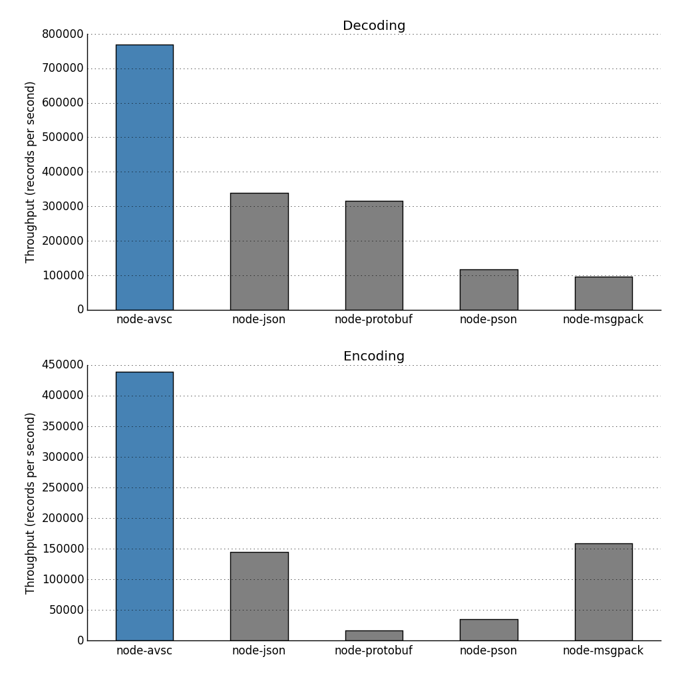

# Avsc [](https://www.npmjs.com/package/avsc) [](https://travis-ci.org/mtth/avsc) [](https://coveralls.io/github/mtth/avsc?branch=master)

Pure JavaScript implementation of the [Avro
specification](https://avro.apache.org/docs/current/spec.html).


## Features

+ [Fast!](#performance) Typically twice as fast as JSON with much smaller
  encodings.
+ Full Avro support, including [schema evolution][schema-evolution] and
  [protocols][rpc].
+ Serialization of arbitrary JavaScript objects via [logical
  types][logical-types].
+ Unopinionated [64-bit integer compatibility][custom-long].
+ No dependencies, `avsc` even runs in the browser.


## Performance

Representative throughput rates (higher is better):



Libraries compared:

+ `node-avsc`, this package.
+ `node-json`, built-in JSON serializer.
+ [`node-protobuf`](https://www.npmjs.com/package/protobufjs), most popular
  Protocol Buffers implementation.
+ [`node-pson`](https://www.npmjs.com/package/pson), alternative to JSON.
+ [`node-msgpack`](https://www.npmjs.com/package/msgpack-lite), official
  MessagePack implementation.

These rates are for processing a [realistic record schema][coupon-schema],
modeled after a popular open-source API. You can find the raw numbers and more
details on the [benchmarks page][benchmarks].


## Installation

```bash
$ npm install avsc
```

`avsc` is compatible with all versions of [node.js][] since `0.11` and all major
browsers via [browserify][].


## Documentation

+ [Overview](https://github.com/mtth/avsc/wiki)
+ [API](https://github.com/mtth/avsc/wiki/API)
+ [Advanced usage](https://github.com/mtth/avsc/wiki/Advanced-usage)


## Examples

Inside a node.js module, or using browserify:

```javascript
var avsc = require('avsc');
```

+ Encode and decode values:

  ```javascript
  var type = avsc.parse({
    name: 'Pet',
    type: 'record',
    fields: [
      {name: 'kind', type: {name: 'Kind', type: 'enum', symbols: ['CAT', 'DOG']}},
      {name: 'name', type: 'string'}
    ]
  });
  var buf = type.toBuffer({kind: 'CAT', name: 'Albert'}); // Encoded buffer.
  var val = type.fromBuffer(buf); // {kind: 'CAT', name: 'Albert'}
  ```

+ Check whether a value fits a given schema:

  ```javascript
  var type = avsc.parse('./Person.avsc');
  var person = {name: 'Bob', address: {city: 'Cambridge', zip: '02139'}};
  var status = type.isValid(person); // Boolean status.
  ```

+ Get a [readable stream][readable-stream] of decoded values from an Avro
  container file:

  ```javascript
  avsc.createFileDecoder('./values.avro')
    .on('metadata', function (type) { /* `type` is the writer's type. */ })
    .on('data', function (val) { /* Do something with the decoded value. */ });
  ```

+ Respond to remote procedure calls over TCP:

  ```javascript
  var protocol = avsc.parse('./Ping.avpr')
    .on('ping', function (req, ee, cb) { cb(null, 'pong'); });

  require('net').createServer()
    .on('connection', function (con) { protocol.createListener(con); })
    .listen(8000);
  ```


[node.js]: https://nodejs.org/en/
[benchmarks]: https://github.com/mtth/avsc/wiki/Benchmarks
[schema-evolution]: https://github.com/mtth/avsc/wiki/Advanced-usage#schema-evolution
[logical-types]: https://github.com/mtth/avsc/wiki/Advanced-usage#logical-types
[custom-long]: https://github.com/mtth/avsc/wiki/Advanced-usage#custom-long-types
[readable-stream]: https://nodejs.org/api/stream.html#stream_class_stream_readable
[browserify]: http://browserify.org/
[coupon-schema]: etc/benchmarks/schemas/Coupon.avsc
[rpc]: https://github.com/mtth/avsc/wiki#and-rpc
