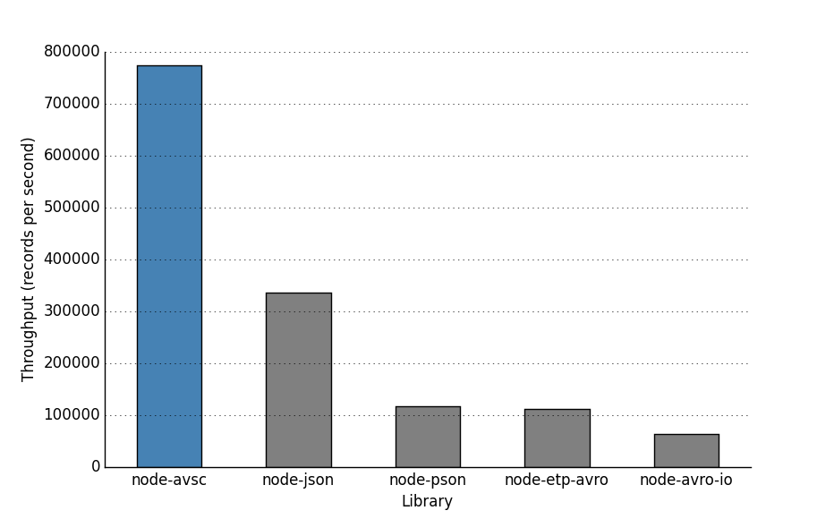

# Avsc [](https://www.npmjs.com/package/avsc) [](https://travis-ci.org/mtth/avsc) [](https://coveralls.io/github/mtth/avsc?branch=master)

Pure JavaScript implementation of the [Avro specification](https://avro.apache.org/docs/current/spec.html).


## Features

+ Full Avro schema support, including recursive schemas, sort order, and [schema
  evolution][schema-evolution].
+ [Fast!](#performance) Typically twice as fast as JSON with much smaller
  encodings (varies per schema).
+ Serialization of arbitrary JavaScript objects via [logical types][logical-types].
+ Unopinionated [64-bit integer compatibility][custom-long].
+ No dependencies, `avsc` even runs in the browser.


## Performance

Representative decoding throughput rates (higher is better):



Libraries compared:

+ `node-avsc`, this package.
+ `node-json`, built-in JSON serializer.
+ [`node-pson`](https://www.npmjs.com/package/pson), an alternative to JSON.
+ [`node-etp-avro`](https://www.npmjs.com/package/etp-avro), existing Avro
  implementation.
+ [`node-avro-io`](https://www.npmjs.com/package/node-avro-io), other popular
  Avro implementation.

These rates are for decoding a [realistic record schema][coupon-schema],
modeled after a popular open-source API. Encoding rates are lower but ratios
across libraries are similar. You can find the raw numbers and more details on
the [benchmarks page][benchmarks].


## Installation

```bash
$ npm install avsc
```

`avsc` is compatible with all versions of [node.js][] since `0.11` and major
browsers via [browserify][].


## Documentation

+ [Overview](https://github.com/mtth/avsc/wiki)
+ [API](https://github.com/mtth/avsc/wiki/API)
+ [Advanced usage](https://github.com/mtth/avsc/wiki/Advanced-usage)


## Examples

Inside a node.js module, or using browserify:

```javascript
var avsc = require('avsc');
```

+ Encode and decode objects:

  ```javascript
  // We can declare a schema inline:
  var type = avsc.parse({
    name: 'Pet',
    type: 'record',
    fields: [
      {name: 'kind', type: {name: 'Kind', type: 'enum', symbols: ['CAT', 'DOG']}},
      {name: 'name', type: 'string'}
    ]
  });
  var pet = {kind: 'CAT', name: 'Albert'};
  var buf = type.toBuffer(pet); // Serialized object.
  var obj = type.fromBuffer(buf); // {kind: 'CAT', name: 'Albert'}
  ```

+ Generate random instances of a schema:

  ```javascript
  // We can also parse a JSON-stringified schema:
  var type = avsc.parse('{"type": "fixed", "name": "Id", "size": 4}');
  var id = type.random(); // E.g. Buffer([48, 152, 2, 123])
  ```

+ Check whether an object fits a given schema:

  ```javascript
  // Or we can specify a path to a schema file (not in the browser):
  var type = avsc.parse('./Person.avsc');
  var person = {name: 'Bob', address: {city: 'Cambridge', zip: '02139'}};
  var status = type.isValid(person); // Boolean status.
  ```

+ Get a [readable stream][readable-stream] of decoded records from an Avro
  container file (not in the browser):

  ```javascript
  avsc.createFileDecoder('./records.avro')
    .on('metadata', function (type) { /* `type` is the writer's type. */ })
    .on('data', function (record) { /* Do something with the record. */ });
  ```


[node.js]: https://nodejs.org/en/
[benchmarks]: https://github.com/mtth/avsc/wiki/Benchmarks
[schema-evolution]: https://github.com/mtth/avsc/wiki/Advanced-usage#schema-evolution
[logical-types]: https://github.com/mtth/avsc/wiki/Advanced-usage#logical-types
[custom-long]: https://github.com/mtth/avsc/wiki/Advanced-usage#custom-long-types
[readable-stream]: https://nodejs.org/api/stream.html#stream_class_stream_readable
[browserify]: http://browserify.org/
[coupon-schema]: etc/benchmarks/schemas/Coupon.avsc
